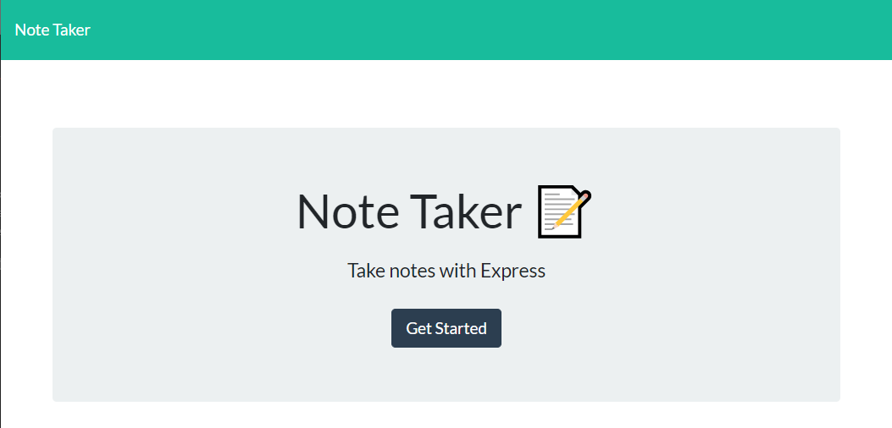
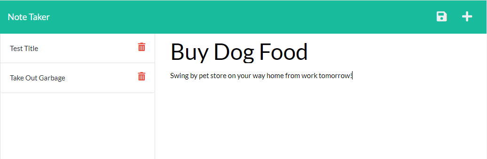

# Note Taker

## Description
Add notes and daily tasks to a list. Add a title and text about the note then click on the save icon. Review your saved notes on the left side of the page and click on them to see more details.

## Table of Contents
* [Deployed Site](#deployed-site)
* [Usage](#usage)
* [Questions](#questions)
* [License](#license)

## Deployed Site
[Use the app](https://fast-ocean-12412.herokuapp.com/)

## Usage
Click on "Get Started" on the landing page. Click within the section to add a note title, then click within the note text section to add note details. Click on the save icon.

## License

---
### Questions
erinnmatesi@gmail.com
[ErinnMatesi](https://github.com/ErinnMatesi)
